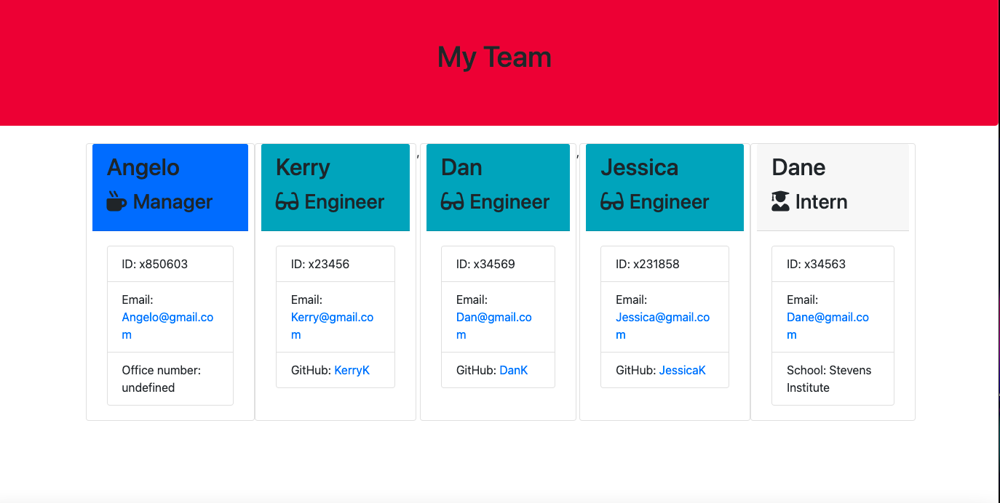

# 10 Object-Oriented Programming: Team Profile Generator

The intent of this repo("Team-Profile-Generator--OOP")is to build a Node.js command-line application that takes in information about employees on a software engineering team and generates an HTML webpage that displays summaries for each person. Because testing is key to making code maintainable, you’ll also write unit tests for each part of your code and ensure that it passes all of them.

This repo uses JavaScript , Node.js principals and Obeject Oriented Programming principles. 
## User Story

```md
AS A manager
I WANT to generate a webpage that displays my team's basic info
SO THAT I have quick access to their emails and GitHub profiles
```

## Acceptance Criteria

```md
GIVEN a command-line application that accepts user input
WHEN I am prompted for my team members and their information
THEN an HTML file is generated that displays a nicely formatted team roster based on user input
WHEN I click on an email address in the HTML
THEN my default email program opens and populates the TO field of the email with the address
WHEN I click on the GitHub username
THEN that GitHub profile opens in a new tab
WHEN I start the application
THEN I am prompted to enter the team manager’s name, employee ID, email address, and office number
WHEN I enter the team manager’s name, employee ID, email address, and office number
THEN I am presented with a menu with the option to add an engineer or an intern or to finish building my team
WHEN I select the engineer option
THEN I am prompted to enter the engineer’s name, ID, email, and GitHub username, and I am taken back to the menu
WHEN I select the intern option
THEN I am prompted to enter the intern’s name, ID, email, and school, and I am taken back to the menu
WHEN I decide to finish building my team
THEN I exit the application, and the HTML is generated
```

## Demonstration

The following video will demonstrate the code as well as running the applicaiton in the command line to show the outcome of the input in the browser:

ScreenShot of Team Generator
;

[The video can be viewed through clicking on this link:](https://www.youtube.com/watch?v=29MpR3SmMBg)


## Getting Started
For this application Jest was used for testing purposes that can be used by installing at (https://www.npmjs.com/package/jest) and to run the actual unit test Inquirere was used which can be viewed at[Inquirer](https://www.npmjs.com/package/inquirer) and will need to be installed with npm install, and npm install inquirer 


## License

[](https://opensource.org/licenses/MIT)
The MIT License was used for the inquirer package. 
